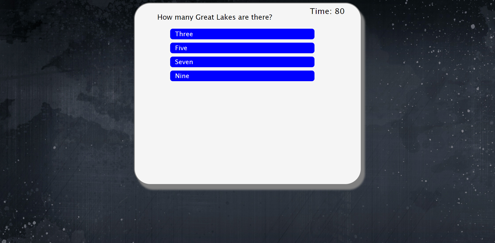
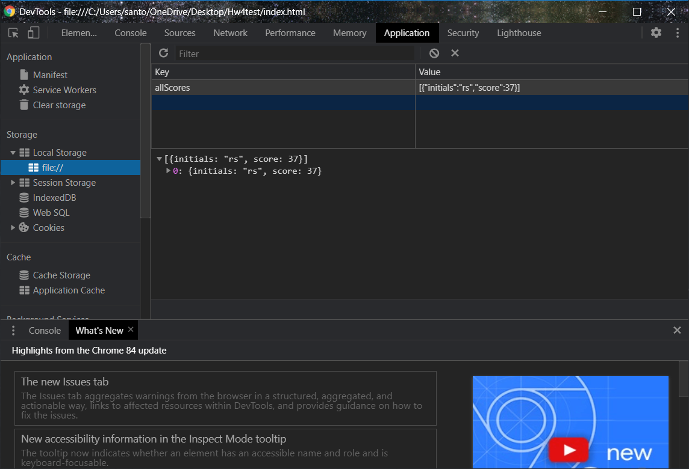

# Geo-Quiz 

## Description
This application uses vanilla javascript to create a dynamic timed quiz. The app will save the user score and display on a separate page. [Here](https://reedsantos.github.io/Geo-quiz/) is the deployed link.

            
## Usage
GIVEN I am taking a code quiz WHEN I click the start button  
THEN a timer starts and I am presented with a question  
WHEN I answer a question THEN I am presented with another question  
WHEN I answer a question incorrectly THEN time is subtracted from the clock  
WHEN all questions are answered or the timer reaches 0 THEN the game is over  
WHEN the game is over THEN I can save my initials and score
## License

## Questions
If anyone has any questions about my application please contact me below.

Reedsantos@icloud.com

[Github link](https://github.com/Reedsantos)
